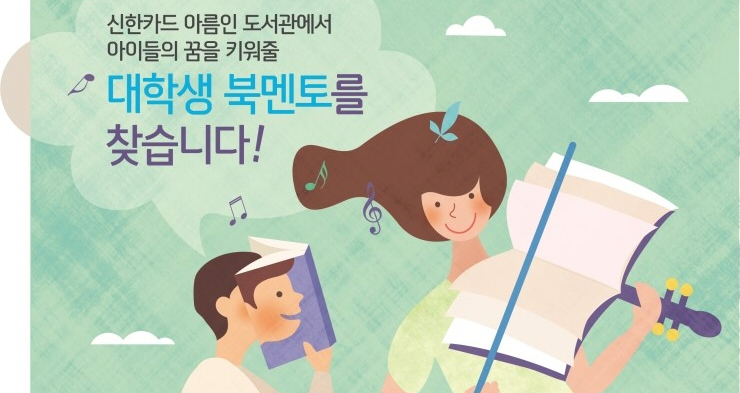
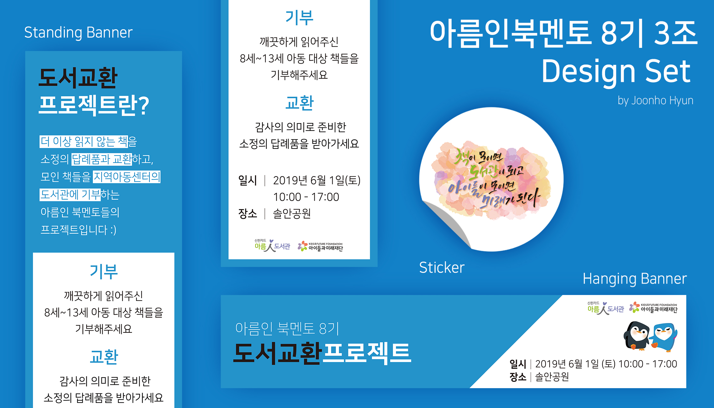

### Abstract
신한카드의 CSR(Corporate Social Responsibiliy, 기업의 사회적 책임) 사업 중 하나인 아름인 도서관과 연계된 활동으로, 지역아동센터나 복지관에 있는 아름인 도서관에 방문하여 초등학생들을 대상으로 독서 멘토링을 진행하고, 조별 미션으로 아름인 도서관을 홍보하는 활동을 기획·진행 후 발표하는 대외활동이다.

### Overview

#### 독서 멘토링

매주 1회씩 지역아동센터에 방문했고, 독서 지도 16차시와 금융교육 2차시를 더해 총 18차시로 진행됐다. 기본적으로 주어지는 멘토링 활동 가이드라인이 있었으나, 아이들이 무언가 만들어서 들고 갈 수 있는 걸 선호한다고 해서 만드는 활동으로 많이 바꾸었다.  
  
아이들과 소통하며 느낀 점이 몇 가지 있었다.  
  
__1. 3~5학년이 정말 어리다는 것__  
  
사실 이 활동 전까지는 초등학생을 만날 일도 거의 없었고, 초등학생을 가르치는 일은 더더욱 없었다. 그래서 아이들의 수준이 어느 정도인지 가늠이 되지 않았고, 수업을 하면서 3~5학년이 정말 어리다는 걸 체감했다. 그래서 조금이라도 어려운 말은 쉽게 바꾸고, 요즘 아이들이 쓰는 말에 대해 배우고, 간혹 남을 배려하지 못하는 행동을 할 땐 이해시켜주려고 노력했다.  
  
__2. 그렇다고 마냥 어리지만도 않다는 것__  
  
어린데도 각자 관심사와 주관이 뚜렷하다는 게 놀라웠다. 책을 얼마나 많이 읽었는지 달달 외워서 얘기하는 아이, 꽤 어려운 과학 지식을 자신 있게 이야기하는 아이, 무언가를 먹을 때 "쌤 먼저 드세요"하며 주는 아이, 그림 그릴 땐 세상 집중해서 조용해지는 아이, 발표할 때는 늘 제일 먼저 손을 들고 신나게 이야기하는 아이... 자기 자신을 만들어가는 과정에 놓여있는 아이들을 보며 내가 지금 하는 일에 대해 일종의 사명감을 가지게 만들었다. 너와 나는 '틀림'이 아닌 '다름'이라는 것, 모두가 잘하는 게 있기 때문에 못하는 일에 풀 죽지 않아도 된다는 것, 모두가 칭찬받을 만한 사람이라는 것. 이런 것들을 매 수업시간마다 생각했던 것 같다.  
  
__3. 내가 아이들을 좋아한다는 것__  
  
한때 아이들을 가르치는 걸 업으로 삼고 싶다는 생각을 한 적이 있었다. 고등학교 때엔 유아교육과를 갈까도 생각했었는데 아이를 좋아하는 것만으로 유아교육을 할 수는 없다고 생각했고, (지금도 그렇게 생각한다.) 주변에서 만류하는 것도 있어서 포기하고 말았다. 이번 아름인 북멘토를 하면서 '내가 정말 아이들을 좋아하는구나'라는 걸 느꼈다. 이를 계기로 학생설계전공으로 '교육컨텐츠설계'라는 전공을 만들었고, 아이들과 함께하는 연합봉사동아리 '단비'에 지원하게 되었고, 아이들과 함께할 수 있는 다른 대외활동들도 찾아보게 되었다.  
  
#### 팀 미션  

"책이 모이면 도서관이 되고, 아이들이 모이면 미래가 된다"라는 슬로건을 시작으로, 시민들로부터 책을 기부받아 답례품과 교환하고 기부받은 책을 아이들이 읽을 수 있도록 도서관에 기부하자는 계획이었다. 아동 도서를 기부받아야 하다 보니 대학가보다는 아파트 단지 내나 공원이 적합하다고 생각했고, 연수구청 공원녹지과의 협력을 구해 솔안공원에서 행사를 진행할 수 있었다. 총 131권의 책이 모였고, 성산사회종합복지관 아름인 도서관에 기부하였다.

#### Work

  
3조 최종 미션 Design Set  
  
__제작__  현준호  

<iframe width="100%" height="56.25%" src="https://www.youtube.com/embed/No_OJxpdeJc" frameborder="0" allow="accelerometer; autoplay; encrypted-media; gyroscope; picture-in-picture" allowfullscreen></iframe>  

3조 최종 미션 영상

__기획__  현준호, 김태오, 문서영, 김수현, 김소정, 조희은  
__촬영__  현준호, 김태오, 조희은  
__편집__  현준호  