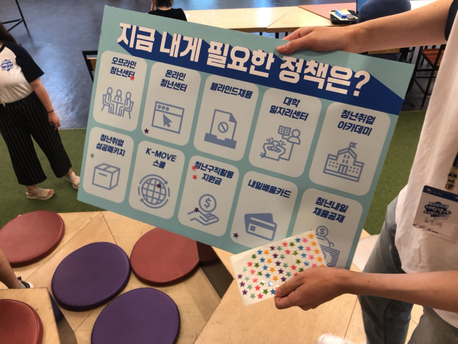
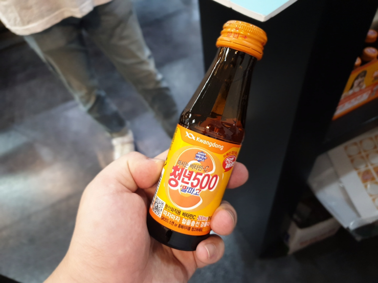
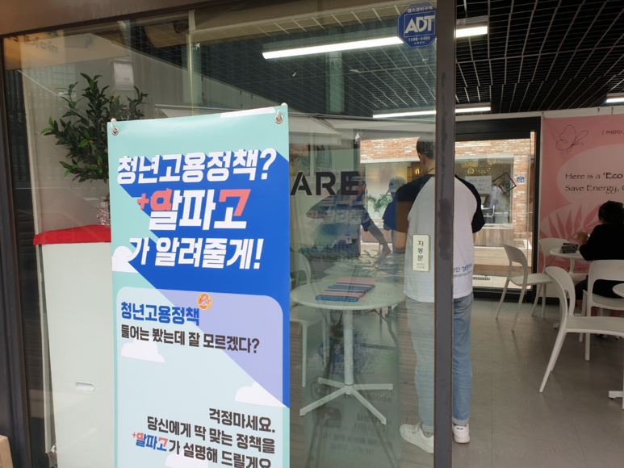
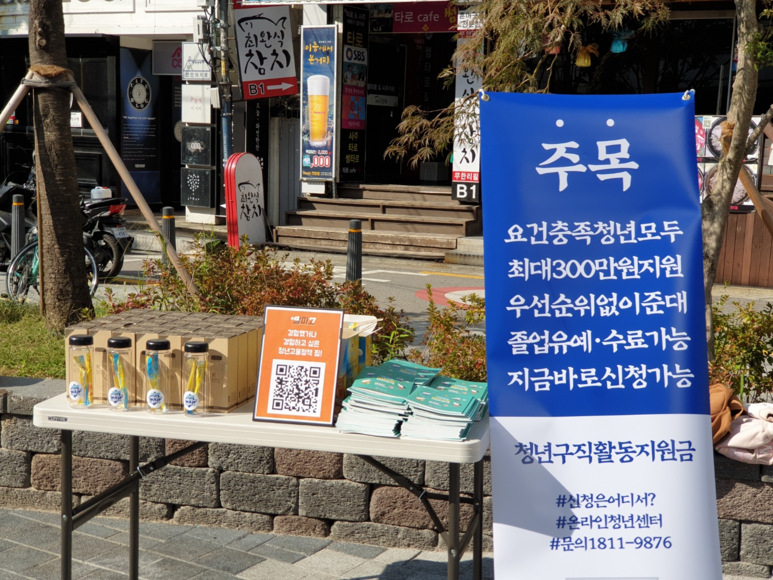
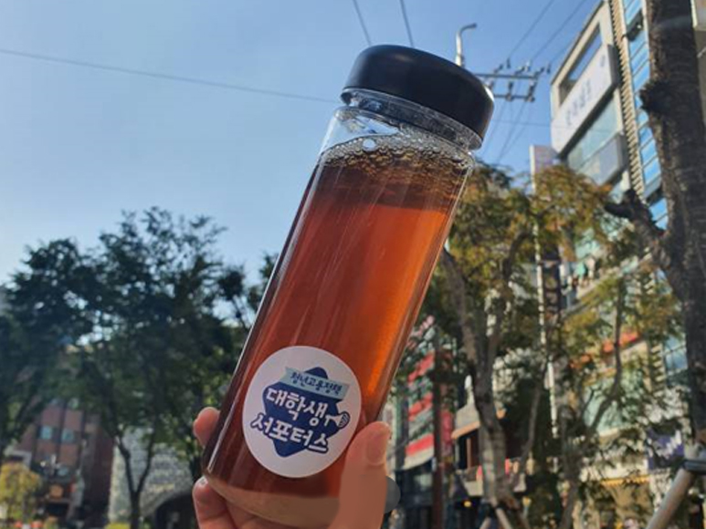
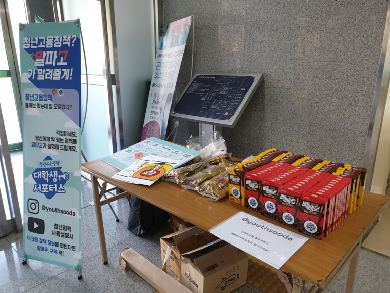
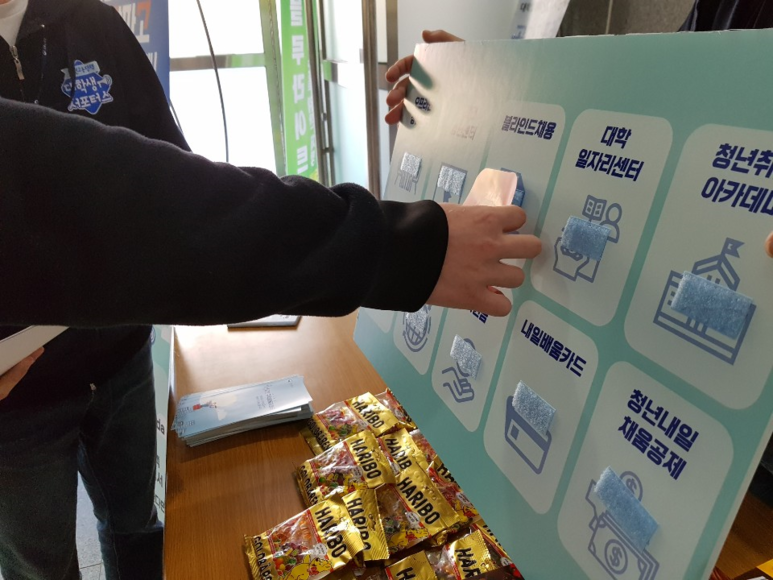
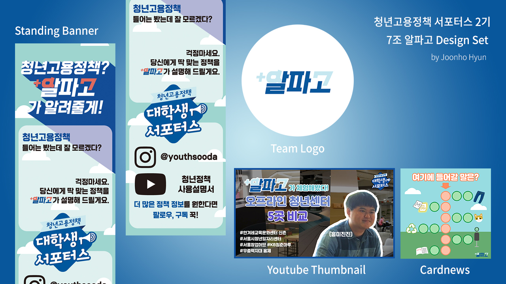

### Abstract
고용노동부에서 주관하고 대학내일에서 운영한 청년 대상 고용정책 홍보 서포터스다. 매달 청년정책사용설명서 공식 유튜브에 업로드되는 온라인 영상과 오프라인 행사를 기획/실행하는 활동이다.

### Overview

__8월__  
  
__사전영상__ 내일배움카드 30초 CF  
__온라인__ 대학일자리센터 먹터뷰  
__오프라인__ 서울시청년일자리센터 청년정책 홍보  
  

__9월__

__온라인__ 청년구직활동지원금 예능 패러디 [아빠가 잠든 후에]  
__오프라인__ 신촌 박스퀘어 청년정책 O, X 퀴즈  

  
  
__10월__
  
__온라인__ 오프라인 청년센터 5곳 비교 체험기  
__오프라인__ 신촌 파랑고래 청년구직활동지원금 홍보  

    
  
__11월__
  
__온라인__ 청년고용정책 겨루기  
__오프라인__ 서강대학교 청년고용정책 캐치마인드 퀴즈  

    
  
### Work

  
7조 알파고 Design Set  
  
__제작__  현준호  

<iframe width="100%" height="56.25%" src="https://www.youtube.com/embed/Pl3TBLBvKJo" frameborder="0" allow="accelerometer; autoplay; encrypted-media; gyroscope; picture-in-picture" allowfullscreen></iframe>  
  

7조 알파고 8월 영상  
상호평가 최우수 선정작

__기획__  현준호, 이정민, 정은형, 정윤성, 박진경  
__촬영__  현준호, 이정민  
__편집__  현준호  

<iframe width="100%" height="56.25%" src="https://www.youtube.com/embed/3GN5JV3RPhg" frameborder="0" allow="accelerometer; autoplay; encrypted-media; gyroscope; picture-in-picture" allowfullscreen></iframe>  
  

7조 알파고 11월 영상

__기획__  현준호, 이정민, 정은형, 정윤성, 박진경  
__촬영__  현준호, 이정민, 정은형, 정윤성, 박진경  
__편집__  현준호  