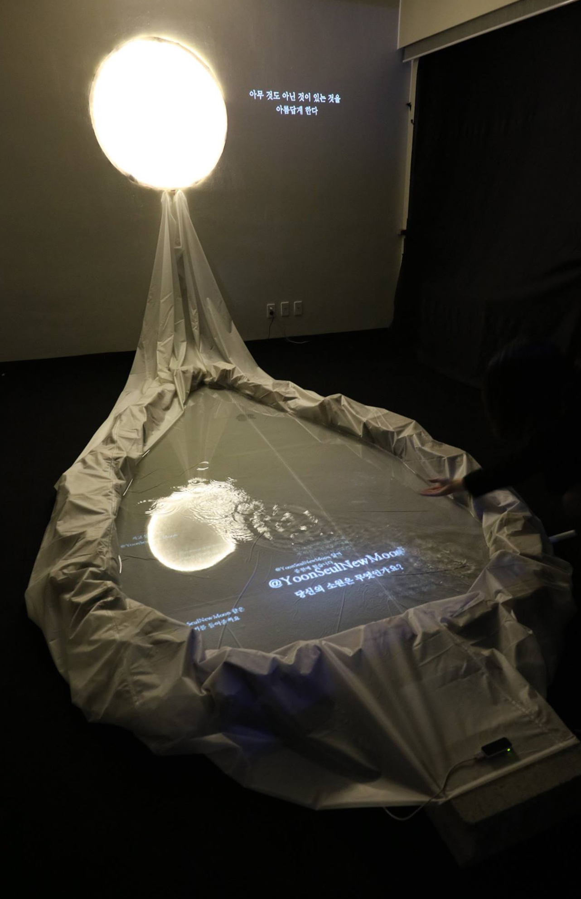
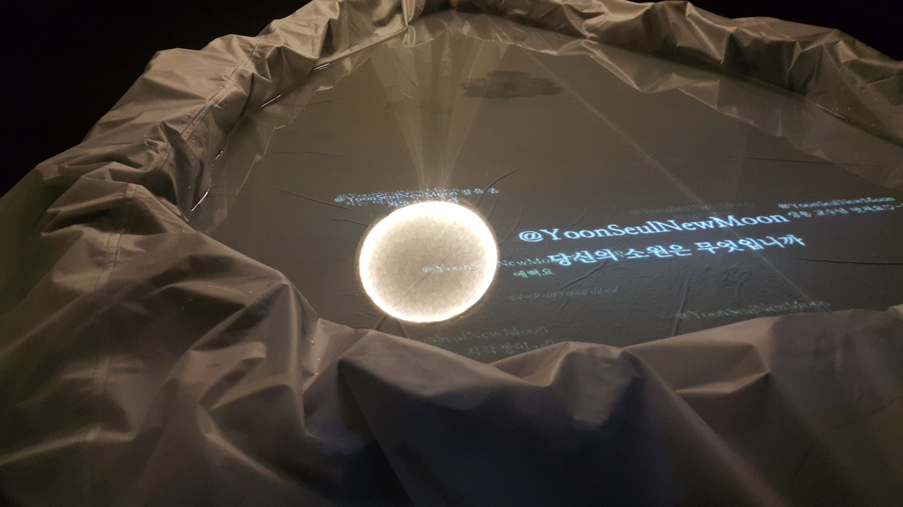

  

### Abstract

__총괄__  권새봄  
__기획, 제작__  뉴문(권새봄, 이세원, 권오연, 이지현, 천재윤, 현준호)

>'윤슬'은 물에 비추어 바스라져 반짝거리는 달빛을 이른다. 뉴미디어와 문학의 결합을 탐구하는 작가집단 뉴문은 달과 물이라는 자연물을 통해 텍스트 읽기의 의미를 묻기 위해 인공수로를 제작하였다. 수로 앞에서 관객은 달과 물 안에 동시에 존재하는 글귀들과 마주치게 된다. 닿을 수 없는 거리에서 미동 없이 인간세계를 바라보는 달과 모든 것을 품고 고임과 흐름을 반복하는 물 사이를 움직이는 텍스트는 미디어가 가진 불확정성과 동시에 의미의 유연성을 느끼게 해준다.

### Overview
  
 
  
 
  
서강대학교 뉴미디어 학회 뉴문(NewMoon)의 2015 Art&Technology Conference <월요일 아침, 의문은 다시 시작되었다> 출품작이다.  
  
이 작품은 불확실성을 껴안고 살아가는 인간에 대한 위로의 순간을 설치미술로 가시화한 것이다. 벽돌와 방수포로 이루어진 수로에 물을 채우고, 천장의 프로젝터를 활용해 텍스트를 프로젝션하였다. 텍스트는 관객들이 작품을 감상한 후 연동된 트위터에 자신의 소망에 대해 리트윗한 내용을 크롤링하여 가져온 것들이다.  
  
벽면에는 달 조명과 함께 소망과 위로에 관련된 문학작품의 문장들이 랜덤으로 프로젝션되도록 설계했다. 수로 앞에 놓인 키스톤 센서가 관객의 모션을 감지하는데, 관객이 물 속의 달을 쓰다듬듯 손 동작을 취하면 사운드와 함께 문장이 전환된다.  