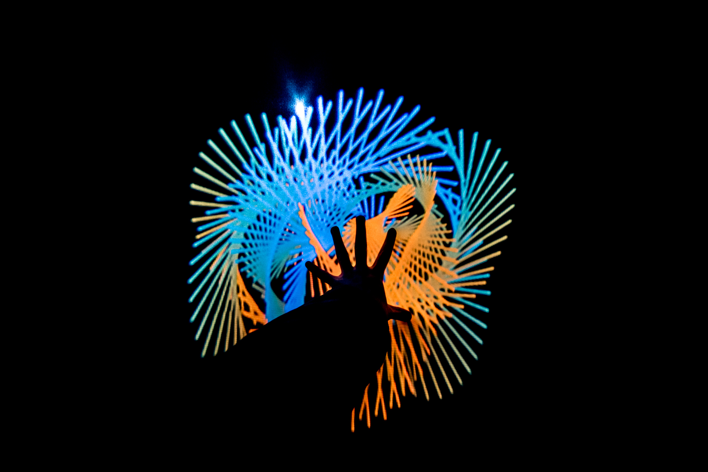
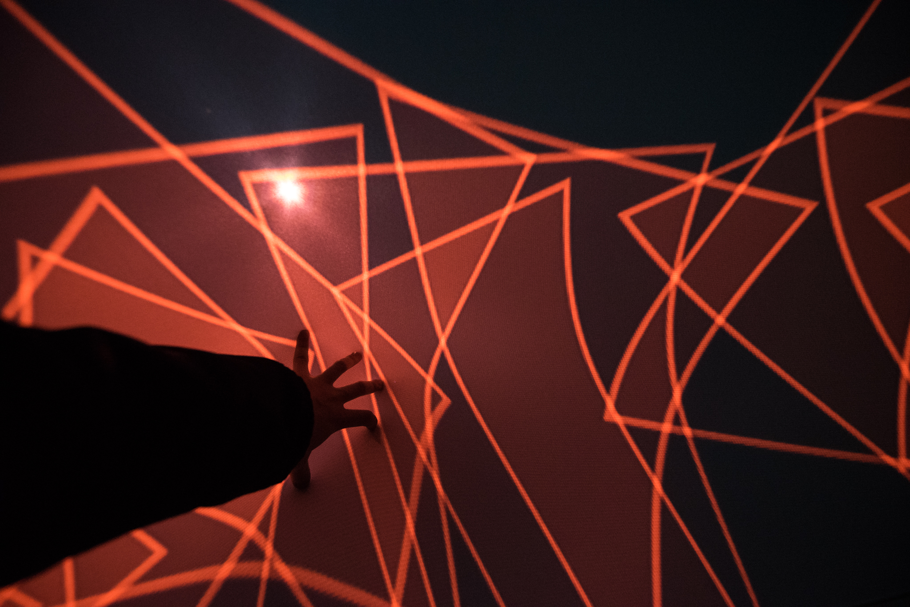

<iframe width="100%" height="56.25%" src="https://www.youtube.com/embed/lS_akq-nF70" frameborder="0" allow="accelerometer; autoplay; encrypted-media; gyroscope; picture-in-picture" allowfullscreen></iframe>
  
아카이빙 영상

__촬영__ 김도균, 현준호  
__편집__ 현준호  

### Abstract

__총괄, 아트__  김도균  
__기획__  현준호    
__테크__  김태훈, 이다영  

>이제까지 '유토피아'라는 개념은 끊임없는 이념적 담론을 통해 어떤 정형화된 이미지로 우리의 머릿속에 자리잡아왔다. 많은 사람들이 유토피아를 이미지적으로 묘사하면 대부분 밝고 신비로운 색채로 구현하고는 한다. 이는 이상적인 공간으로 규정되는 유토피아의 세계가 아이러니하게도 개개인의 다양한 상상력과 가치관을 담아내지 못했다는 것을 방증하는 것이다. 우리 삶에서 유토피아가 멀게만 느껴지는 것도 이런 이유에서 일지도 모른다.  
>  
>'유토피아의 사유화'는 개인이 품고 살아왔던 가치관이 내면의 담론을 통해 하나의 틀로 합치된 것이다. 유토피아라는 것 자체가 그것을 고안해낸 개인의 상상력과도 연관되어 있기 때문에 공간의 성격이나 특성을 일률적으로 규정하거나 일반화하기 어렵다.  
>  
>내면화의 과정을 통해 자신의 가치관이 투영된 공간을 바라볼 때가 유토피아를 진정으로 마주하는 순간이라고 할 수 있는 것이다.

### Overview

  
  

  
서강대학교 미디어아트 팀 ANTS의 2015 Art&Technology Conference <월요일 아침, 의문은 다시 시작되었다> 출품작이다.  
  
가로, 세로, 높이 2M의 프레임에 천을 감싸고, 사면에 키넥트와 프로젝터를 설치하여 관객이 천을 터치할 때마다 Processing으로 코딩된 영상이 반응하도록 제작되었다. 넓은 유토피아의 스펙트럼 중 팀 ANTS가 선정한 네 개의 유토피아를 감상하고, 마지막에 하얀 화면이 나타날 때 관객들은 자신의 유토피아를 상상해볼 수 있을 것이다.  
  
2016 디노마드 Young Creative Korea에 우수 아티스트 300팀에 선정되어 전시되었고, 그 중 최우수 아티스트 40팀 안에 선정됐다.