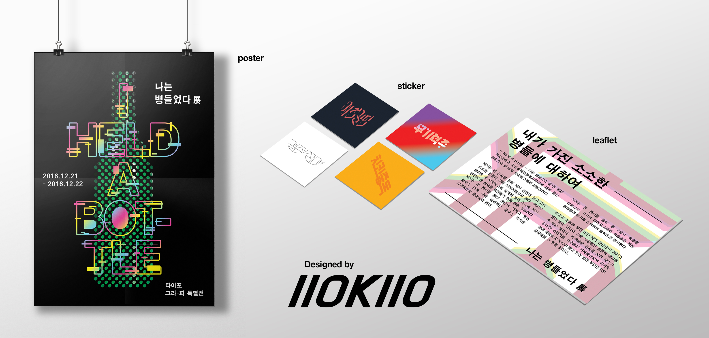

### Abstract
<I Held A Bottle ─ 나는 병들었다 展>이라는 가상의 타이포그래피 개인전의 메인 포스터와 작품, 리플렛을 디자인하고 전시했다. 작품들은 스티커로도 만들어져 관객들이 자유롭게 가져갈 수 있게 했다.

### Overview
2016-2 Design 수업의 기말 과제로 제출한 아트워크다. 이 프로젝트의 시작은 말장난이었다. 'I Held A Bottle'을 직역하면 '나는 병 들었다.'가 된다는 것을 시작으로 "누구나 하나쯤 가지고 있는 특성이나 성향을 병에 비유해보면 어떨까?"라는 생각이 들었다. 이 아이디어를 바탕으로 맨 처음 만든 작품이 <치킨중독>이었고, 그 뒤로 <결정장애>, <애정결핍>, <무기력증>의 세 작품을 연달아 만들었다.  
  
메인 포스터는 CMYK Color와 Glitch 효과를 섞어 어지러움을 표현했다. 메인 오브제가 초록색 병인 것도 술을 연상케하고 싶어서였다. 리플렛은 한자 病을 직선으로 만든 뒤 CMYK color로 표현했다.  
  
아래는 리플렛에 적었던 전시에 관한 설명이다.

> __내가 가진 소소한 병들에 관하여__  
>  
><I Held A Bottle ─ 나는 병들었다 展>은 서강대학교 아트&테크놀로지에 재학 중인 현준호의 첫 번째 타이포그래피 개인전이다.  
>  
>작가는 본 전시를 통해 작가 본인이 앓고 있는 소소한 병들에 대해 이야기하고자 한다. 여기서 병이란 꼭 의학적으로 정의된 병이 아니라 작가 본인의 현 상태를 표현하기 위해 만든 것들이다. 작가는 본 전시를 통해 본인이 가지고 있는 병적인 면에 대해 해학적인 문구와 키치한 그래픽으로 풀어보려 한다.  
>  
>작가는 본 전시를 통해 총 4점의 작품을 선보인다. 각각의 타이포그래피 작품들은 작은 인쇄물과 스티커의 형식으로 전시된다.  
>  
>작가가 표현한 병은 비단 작가 본인만이 가지고 있는 병이 아니라 다른 사람들도 충분히 공감할 수 있는 병이다. 관객들은 전시를 보며 작가가 준비한 스티커를 자유롭게 가져감으로써 작가의 병에 공감하고 자신이 앓고 있는 병은 무엇인지도  상상해볼 수 있을 것이다.  
  
IIOKIIO는 내 이름의 초성인 ㅎㅈㅎ을 옆으로 돌린 것이다.