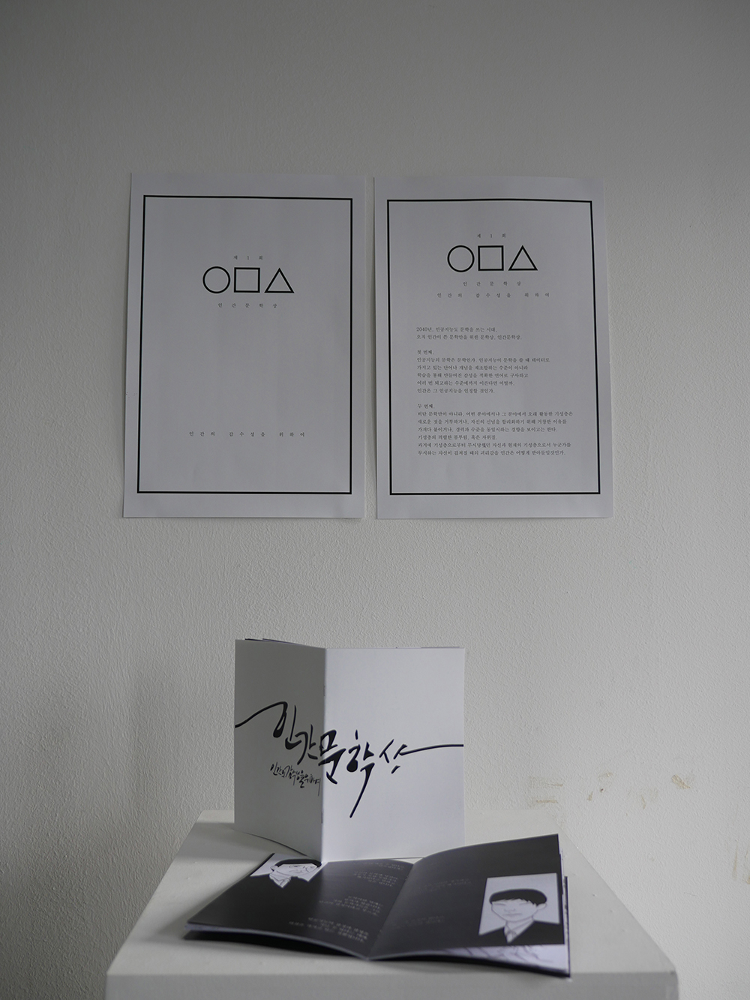

### Abstract
2040년, 인공지능도 문학을 쓰는 시대. 오직 인간이 쓴 문학만을 위한 문학상. 인간문학상.

### Overview
__표지__
  
  

  
__내지 중 일부__  
  
  

    
'2040'이라는 대주제 속에서 말하고자 하는 담론은 두 가지였다.  
  
__첫 번째,__  
인공지능의 문학은 문학인가. 인공지능이 문학을 쓸 때 데이터로 가지고 있는 단어나 개념을 재조합하는 수준이 아니라 학습을 통해 만들어진 감성을 적확한 언어로 구사하고 여러 번 퇴고하는 수준에까지 이른다면 어떨까. 인간은 그 인공지능을 인정할 것인가.  
  
__두 번째,__  
비단 문학만이 아니라, 어떤 분야에서나 그 분야에서 오래 활동한 기성층은 새로운 것을 거부하거나, 자신의 신념을 합리화하기 위해 거창한 이유를 가져다 붙이거나, 경력과 수준을 동일시하는 경향을 보이고는 한다. 기성층의 격렬한 몸부림, 혹은 자위질. 과거에 기성층으로부터 무시당했던 자신과 현재의 기성층으로서 누군가를 무시하는 자신이 겹쳐질 때의 괴리감을 인간은 어떻게 받아들일 것인가.  
  
'인간적'이라는 것이 얼마나 나약한 개념인지에 대해 이야기하고, 오로지 '인간이 아닌 것'을 규정함으로써만 자신의 위치를 지킬 수 있는 인간을 인간 소설가 J와 인공지능 소설가 L의 대화로 표현했다.