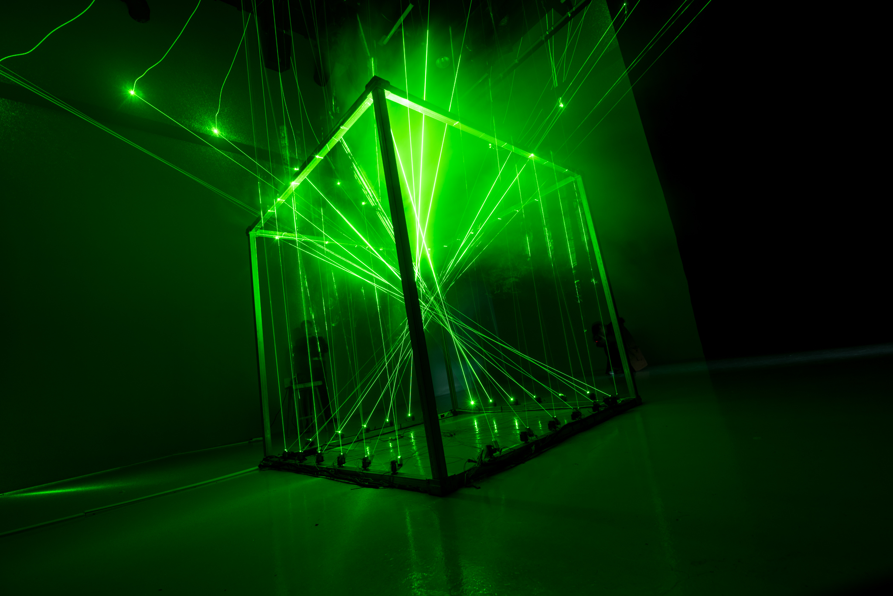
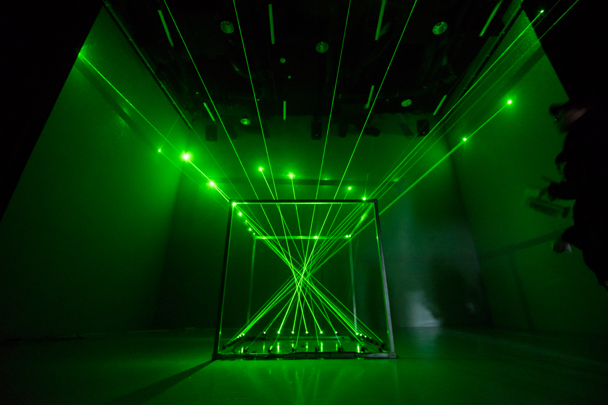

<iframe width="100%" height="56.25%" src="https://www.youtube.com/embed/BrQYkTblf7g" frameborder="0" allow="accelerometer; autoplay; encrypted-media; gyroscope; picture-in-picture" allowfullscreen></iframe>
  
아카이빙 영상

__촬영__ 김도균, 현준호  
__편집__ 현준호  

### Abstract
__총괄__  김태훈  
__기획__  현준호  
__아트__  김도균  
__테크__  조남준  
__음악__  최재원  

>'환상'은 완성된 모습이나 원형이 존재하지 않는다. 계속해서 붕괴되고 재배열되며 그 모습을 바꾸기 때문이다.

### Overview

  
  

서강대학교 미디어아트 팀 ANTS의 2016 Art&Technology Conference <당신의 하루는 환상으로 가득한가요?> 출품작이다. 가로, 세로, 높이 2M의 프레임에 움직이는 20개의 레이저를 통해 끊임없이 변형되는 환상의 추상적 모습을 표현했다.  
  
2017 HCI Korea Creative Awards 참여작으로 선정되어 전시했다.