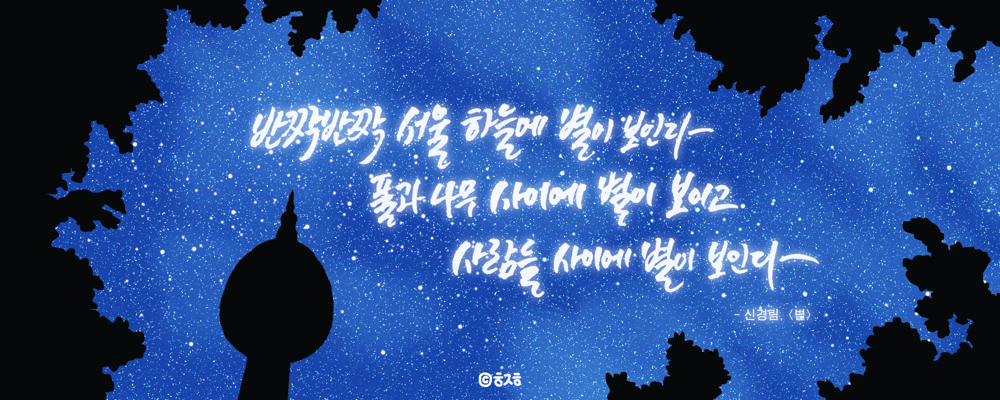
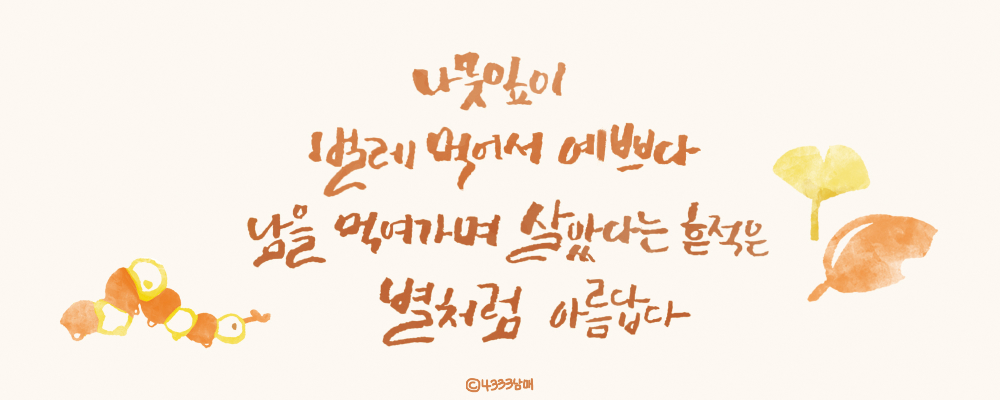
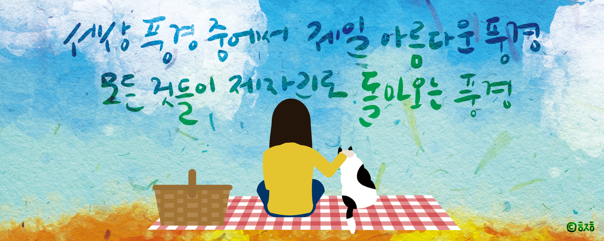

### Abstract

광화문글판은 교보생명 사옥에 부착되어 있는 시민을 위한 글판이다. 계절마다 바뀌는데, 매년 가을 글판은 대학생들을 대상으로 하는 '교보생명 광화문글판 대학생 디자인 공모전'을 통해 7개의 작품을 선발하고, 대상 수상작은 광화문글판에 걸리게 된다. 총 3년을 도전했고, 모두 수상에 실패했다.

### Overview

#### 2017

 

__문구__
>반짝반짝 서울 하늘에 별이 보인다  
>풀과 나무 사이에 별이 보이고  
>사람들 사이에 별이 보인다  
>-- 신경림, 별  
  
__컨셉__  
시구 자체가 이미지에서 직관적으로 잘 느껴지게 하는 데에 초점을 두었다. 당시의 나는 서울의 랜드마크로 남산타워를 선택했다. 내가 마치 한밤 중에 남산 한가운데 있는 것처럼 그림자처럼 보이는 나무들과 멀리서 보이는 남산타워, 그리고 그 안에서 반짝거리는 별들을 담았다. 글씨는 캘리그라피로 직접 썼고, 빛나는 느낌을 주고 싶어서 네온 느낌으로 감쌌다.  

#### 2019

 

__문구__
>나뭇잎이  
>벌레 먹어서 예쁘다  
>남을 먹여가며 살았다는 흔적은  
>별처럼 아름답다  
>-- 이생진, 벌레 먹은 나뭇잎  
  
__컨셉__  
이건 처음으로 팀으로 작업한 작업물이다. 4333남매라는 이름으로 최우림, 송진경과 함께 작업했다. 원래 이걸 작업하려고 만난 건 아니었는데, 어쩌다 보니 광화문글판 이야기가 나왔고, 자연스럽게 우림이 컵홀더에 글씨를 쓴 것에서 시작됐다. 진경이 전체적인 레이아웃과 색깔을, 내가 수채화 텍스쳐를 작업해서 결과물이 나왔다.  
  
#### 2020

 

__문구__
>세상 풍경 중에서 가장 아름다운 풍경  
>모든 것들이 제자리로 돌아오는 풍경  
>-- 시인과 촌장, 풍경  
  
__컨셉__  
이번 문안은 포크 음악 그룹 시인과 촌장의 노래 '풍경'의 가사였다. 이번엔 광화문글판 30주년이었고, 코로나19로 엉망이 된 일상이 돌아왔으면 하는 염원이 담긴 문안인 듯하여 그 점에 초점을 맞춰 작업했다. 종이 질감의 텍스쳐 위에 수채화 질감으로 배경을 그리고, 플랫 일러스트로 코로나 19가 끝나면 가을 들판에서 일상적으로 볼 수 있을 것만 같은 풍경을 그렸다.